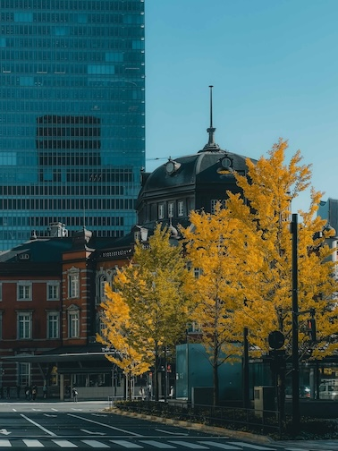

  

<h1 align="center">Lightroom Presets</h1>

Custom presets by [@taro710](https://github.com/taro710). The files are in xmp format.

## filmic-daylight-hdr

**[Source](https://github.com/taro710/lightroom-presets/blob/main/presets/filmic-daylight-hdr.xmp)**

## night-blue

**[Source](https://github.com/taro710/lightroom-presets/blob/main/presets/night-blue.xmp)**

## Interstellar

**[Source](https://github.com/taro710/lightroom-presets/blob/main/presets/Interstellar.xmp)**

## autumn-portrait

**[Source](https://github.com/taro710/lightroom-presets/blob/main/presets/autumn-portrait.xmp)**

## T&O

**[Source](https://github.com/taro710/lightroom-presets/blob/main/presets/T%26O.xmp)**
